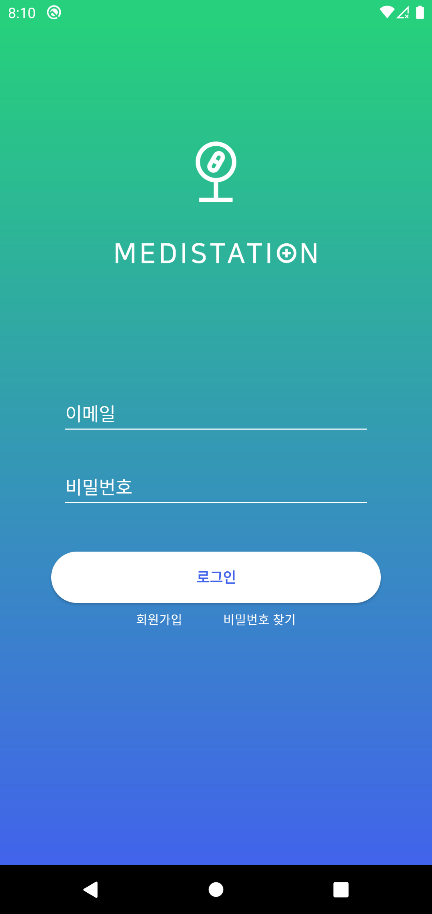
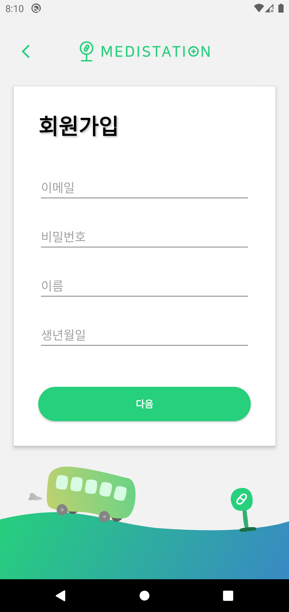
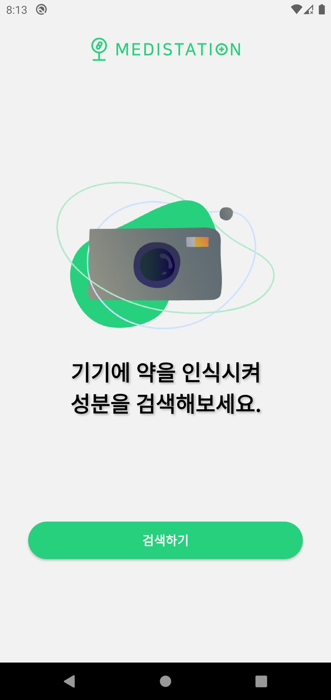
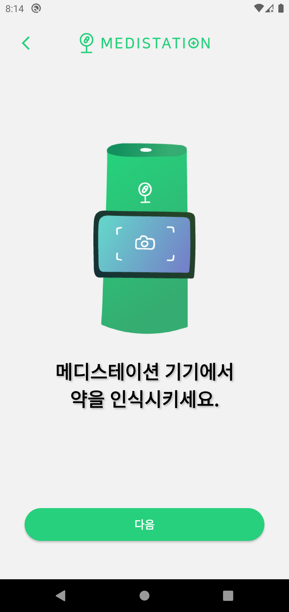
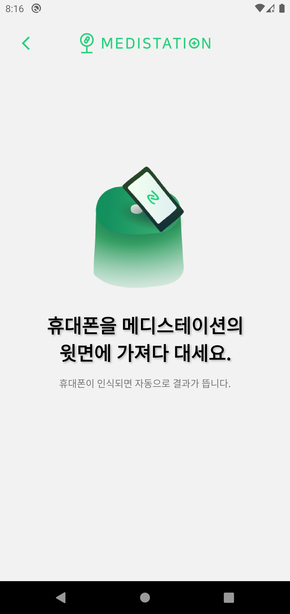
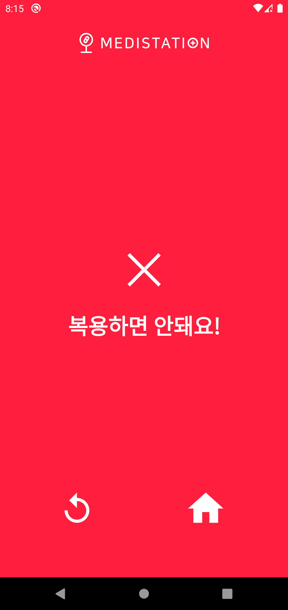
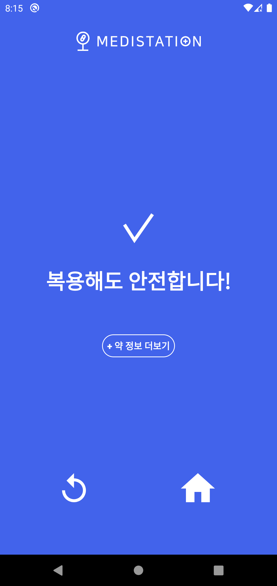
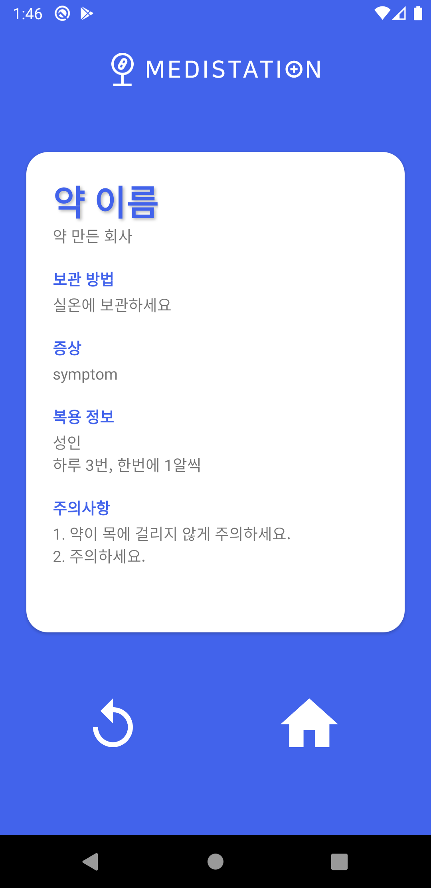

medistation-android
===
제 3회 화성시 동탄 ICT 메이커톤 최우수상 '메디스테이션' 안드로이드  

  
위 사진을 클릭하면 유튜브로 넘어갑니다.  

사용자가 Medistation 기기에 약을 스캔하면 그 사용자의 의학 정보에 따라 복용 가능한 약인지 아닌지를 판단해 의학적 사고를 줄이기 위한 서비스입니다.

## 로그인
</img>  

## 회원가입
회원가입할 때 사용자에 대한 의학 정보를 수집합니다.  
</img>  

## 메인화면
</img>  

## 검색하기
메인화면에서 검색하기 버튼을 누르면 약을 검색하기 위한 프로세스가 시작됩니다.  
</img>  
</img>  

## 검색 결과
</img>  
</img>  
</img>  
